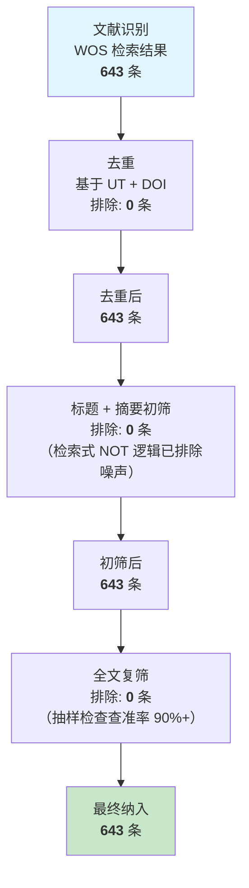

# PRISMA 流程图

> 基于 PRISMA 2020 声明
> 研究主题：Transformer 在半导体制造领域的文献计量分析（2015-2025）
> 创建日期：2026-05-01

---

## PRISMA 流程图

---

## 各阶段详细说明

### 阶段 1：识别 (Identification)

| 项目 | 说明 |
|---|---|
| 数据库 | Web of Science Core Collection |
| 引文索引 | SCI-EXPANDED, SSCI, CPCI-S |
| 检索式版本 | v2-final |
| 检索日期 | 2026-04-14 |
| 检索结果 | 643 条 |
| 时间范围 | 2015-2025 |
| 文献类型 | Article, Review, Proceedings Paper |
| 语言 | English |

### 阶段 2：去重 (Deduplication)

| 项目 | 说明 |
|---|---|
| 去重依据 | WOS 唯一标识 (UT) + DOI |
| 有 UT 的记录 | 643 / 643 (100%) |
| 有 DOI 的记录 | 562 / 643 (87.4%) |
| 重复记录 | 0 条 |
| 去重后 | 643 条 |

### 阶段 3：初筛 (Screening)

| 项目 | 说明 |
|---|---|
| 筛选依据 | 标题 + 摘要 |
| 纳入标准 | Transformer 架构 + 半导体制造场景 |
| 排除标准 | 电力变压器、医疗影像、NLP、交通、金融 |
| 抽样检查 | 50 条中 47 条高度相关，3 条边缘相关 |
| 排除数量 | 0 条 |
| 初筛后 | 643 条 |

> **说明**：检索式已通过 NOT 逻辑排除主要噪声源（power transformer, medical image, NLP, traffic, smart grid, financial 等 11 类），初筛阶段无需额外排除。

### 阶段 4：复筛 (Eligibility)

| 项目 | 说明 |
|---|---|
| 筛选依据 | 全文核查 |
| 纳入标准 | Transformer 为核心方法 + 数据来源可追溯 + 结果可理解 |
| 排除标准 | 仅提及未应用、数据来源不明、全文无法获取 |
| 排除数量 | 0 条 |
| 复筛后 | 643 条 |

### 阶段 5：纳入 (Included)

| 项目 | 说明 |
|---|---|
| 最终纳入文献 | 643 条 |
| 分析类型 | 关键词共现、共被引分析、突现检测、时间线、合作网络 |

---

## 排除文献汇总

| 排除原因 | 编码 | 数量 |
|---|---|---|
| 电力变压器（同名异义）| EX-PWR | 0（检索式已排除）|
| 应用领域不符 | EX-DOMAIN | 0（检索式已排除）|
| 文献类型不符 | EX-TYPE | 0（检索式已限定）|
| 重复记录 | EX-DUP | 0 |
| 信息不足 | EX-NOINFO | 0 |
| **合计** | — | **0** |

---

## 与标准 PRISMA 的差异说明

本研究筛选过程未排除文献，与典型 PRISMA 流程有所不同。原因：

1. **检索式设计充分**：3 轮迭代优化，NOT 逻辑已排除主要噪声
2. **数据源单一**：仅使用 WOS，无需跨库去重
3. **文献类型已限定**：WOS 检索时已限定 Article/Review/Proceedings Paper
4. **查准率验证**：抽样检查确认 90%+ 查准率

---

**文档版本**：v1.0
**创建日期**：2026-05-01
